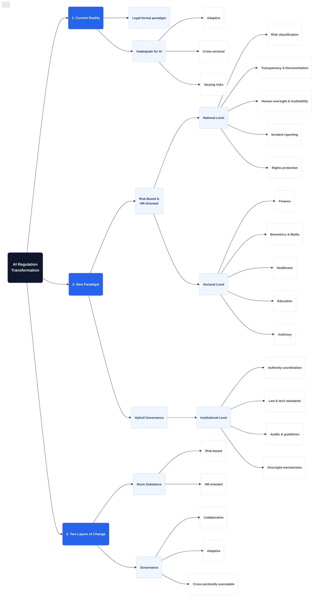

# AI Regulation Transformation (Structured Flowchart)

Mermaid `mindmap` bawaan menyebarkan node secara radial tanpa arah yang jelas, membuatnya sulit dibaca.
Pendekatan **Flowchart (Kiri ke Kanan)** ini jauh lebih terstruktur (seperti pohon hierarki folder).

